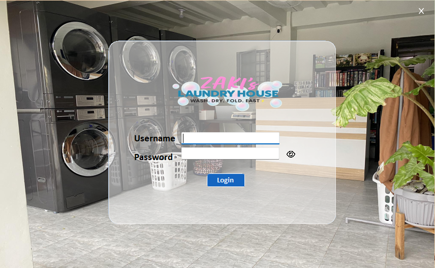
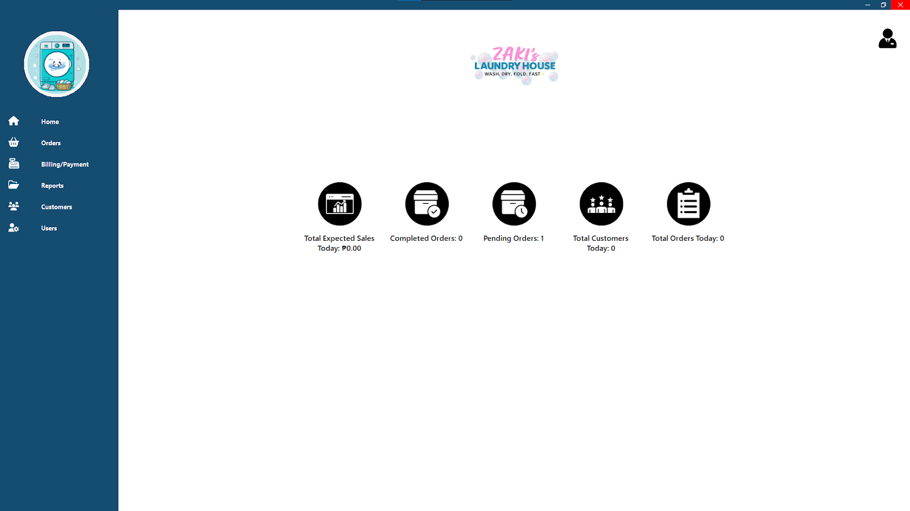
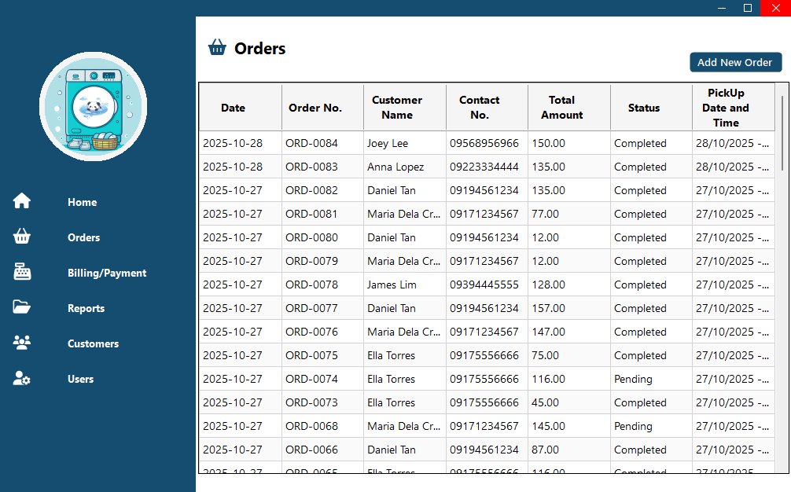
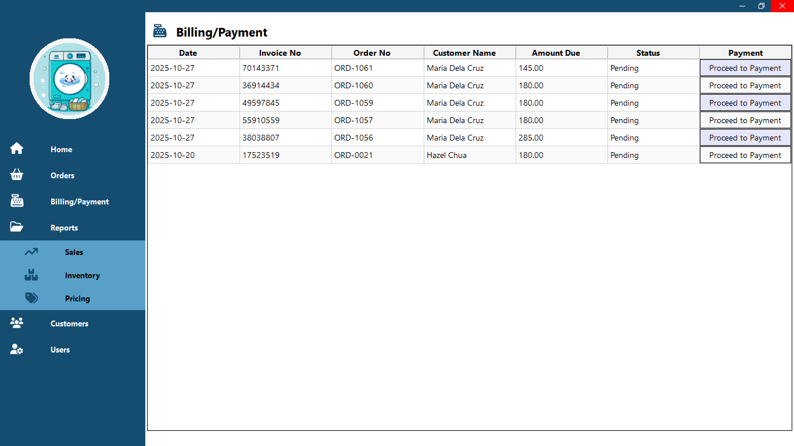
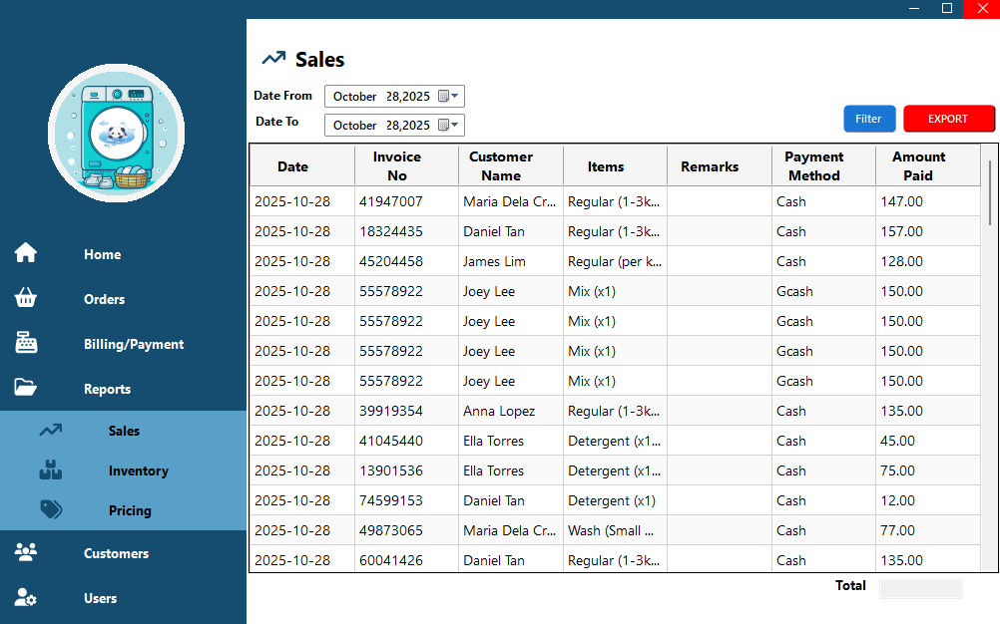
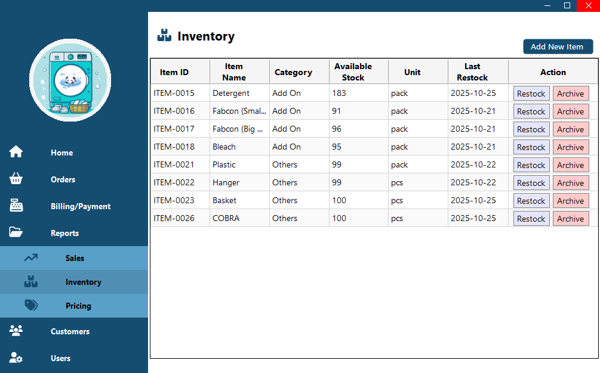
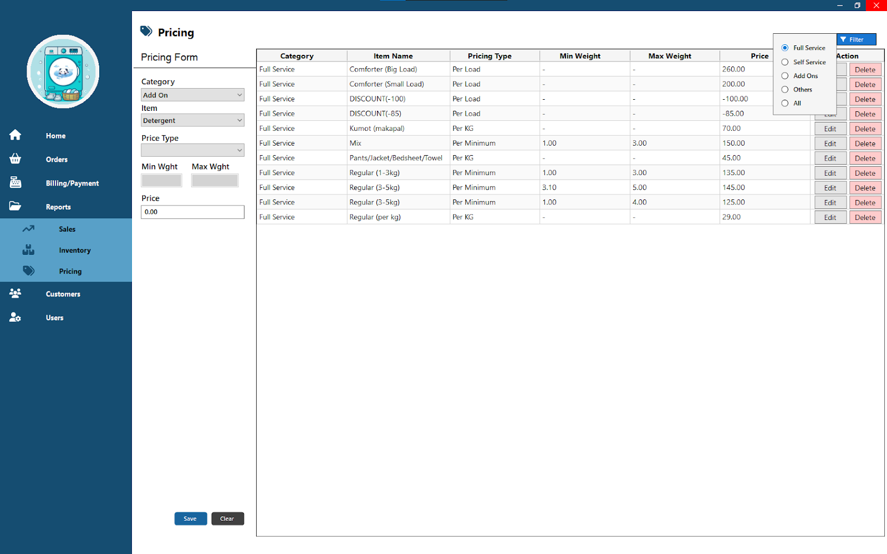
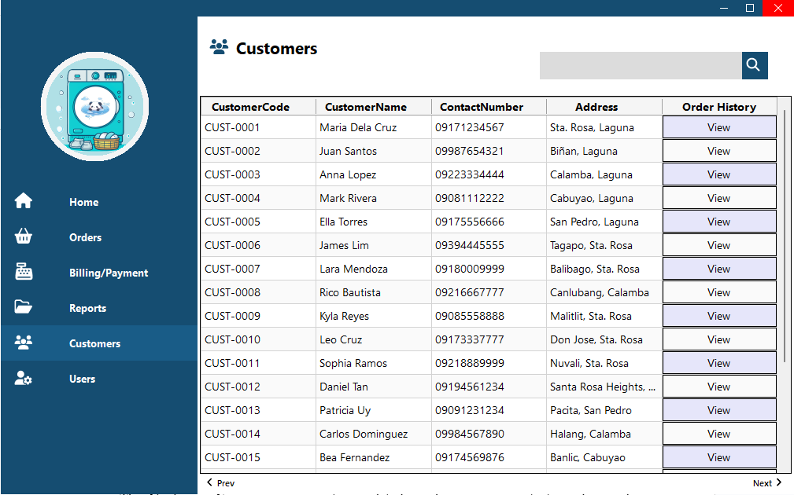
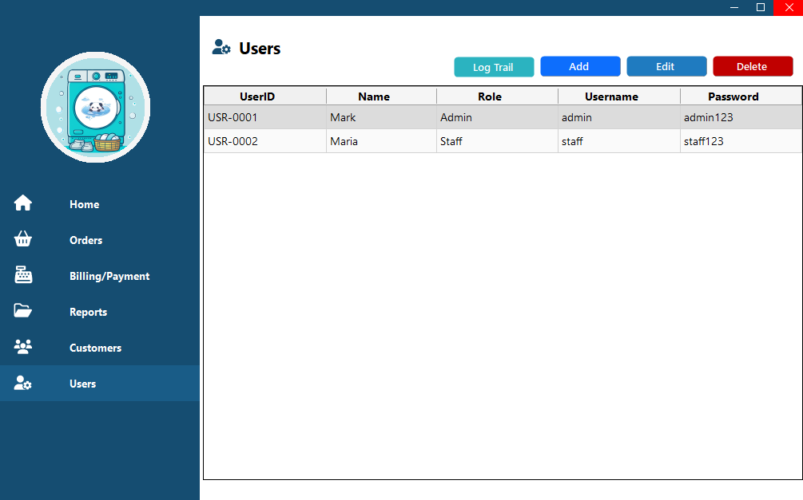

# Record Management and Billing System for Zaki's Laundry House

A desktop-based *Record Management and Billing System* developed for *Zaki's Laundry House* to digitalize and automate daily business operations. The system replaces manual logbooks and paper-based transactions with a centralized management system that streamlines customer management, order processing, billing, inventory monitoring, pricing management, and sales reporting.

Developed as a Capstone Project at **STI College Santa Rosa**.
---

## Overview

Zaki's Laundry House previously relied on manual record-keeping for customer information, orders, billing, inventory, and sales. As the business expanded, these manual processes became inefficient, time-consuming, and prone to human error.

To address these challenges, this desktop application was developed to automate daily operations, improve record accuracy, simplify billing, and provide organized business reports through a secure and user-friendly interface.

---

## Key Features

### Authentication & User Roles
- Secure login system
- Role-based access control
- Administrator and Staff accounts
- Activity Log (Audit Trail)

### Customer Management
- Register new customers
- Update customer information
- Search customer records
- View customer transaction history

### Order Management
- Create and manage laundry orders
- Update order status
- View order history
- Automatic billing computation

### Billing & Payments
- Generate customer invoices
- Process customer payments
- Print *unofficial receipts*
- Track billing history and payment status

### Inventory Management
- Monitor inventory levels
- Add and update inventory items
- Low-stock notifications
- Inventory reports

### Pricing Management
- Manage laundry service pricing
- Update service rates
- Organize pricing by service type

### Sales & Reports
- Daily and monthly sales reports
- Customer reports
- Inventory reports
- Export reports to *Excel* and *PDF*

### User Management
- Add new users
- Edit user information
- Delete users
- Manage user roles and permissions

---

## System Modules

- Login
- Dashboard
- Customer Management
- Orders
- Billing & Payment
- Inventory
- Pricing
- Sales Reports
- User Management
- Activity Logs

---

## Built With

| Technology | Purpose |
|------------|---------|
| *C#* | Desktop Application Development |
| *Windows Forms* | User Interface |
| *Microsoft SQL Server* | Database Management |
| *Visual Studio* | Development Environment |
| *Crystal Reports* | Report Generation |
| *.NET Framework* | Application Framework |

---

## Screenshots

<table>
<tr>
<td align="center" width="50%">



### Login

Secure authentication for administrators and staff.

</td>

<td align="center" width="50%">



### Dashboard

Displays business summary, sales overview, and system statistics.

</td>
</tr>

<tr>
<td align="center">



### Orders

Create, update, and manage customer laundry orders.

</td>

<td align="center">



### Billing & Payment

Process payments and generate *unofficial receipts*.

</td>
</tr>

<tr>
<td align="center">



### Sales

Generate, filter, and export sales reports to Excel and PDF.

</td>

<td align="center">



### Inventory

Monitor stock levels, manage supplies, and receive low-stock alerts.

</td>
</tr>

<tr>
<td align="center">



### Pricing

Manage laundry service prices and update service rates.

</td>

<td align="center">



### Customers

Register customers and view their transaction history.

</td>
</tr>

<tr>
<td align="center">



### User Management

Manage administrator and staff accounts with role-based access.

</td>

<td align="center">

</td>
</tr>
</table>

**Note**

This system generates **unofficial receipts** intended for transaction acknowledgment and internal record-keeping only. It is **not integrated with the Philippine Bureau of Internal Revenue (BIR)** and does **not** issue official receipts.


---

## User Roles

### Administrator
- Full system access
- Manage users
- Manage inventory
- Manage pricing
- Generate reports
- View sales analytics
- Monitor activity logs

### Staff
- Manage customers
- Process orders
- Process billing
- Print unofficial receipts
- View inventory
- View pricing

---

## System Workflow

```
Login
   ↓
Dashboard
   ↓
Register Customer
   ↓
Create Order
   ↓
Generate Invoice
   ↓
Receive Payment
   ↓
Print Unofficial Receipt
   ↓
Update Sales & Reports
```
---

## Project Objectives

- Replace manual record-keeping with a digital solution.
- Improve billing accuracy and efficiency.
- Organize customer information.
- Simplify inventory monitoring.
- Generate reports instantly.
- Reduce transaction processing time.
- Improve overall business productivity.

---

## Repository Structure

```
Record-Management-and-Billing-System/
│
├── ZakiLaundryHouse/
├── Database/
├── Reports/
├── Resources/
├── screenshots/
├── README.md
└── ZakiLaundryHouse.sln
```
---

## Project Highlights

- Secure user authentication
- Customer record management
- Order processing
- Billing and payment processing
- Unofficial receipt generation
- Inventory monitoring
- Pricing management
- Sales reporting
- Export reports to Excel and PDF
- Activity logging (Audit Trail)

---

## Results

The implementation of the system significantly improved the daily operations of Zaki's Laundry House by:

- Reducing manual record-keeping errors
- Improving customer transaction speed
- Organizing customer information efficiently
- Enhancing inventory monitoring
- Providing accurate sales reports
- Increasing overall operational efficiency

---

## Disclaimer

This project was developed *for academic purposes* as a Capstone Project at *STI College Santa Rosa*.

The receipt generated by the system is an *unofficial receipt* intended solely for internal business record-keeping and customer transaction acknowledgment. It is *not* a BIR-accredited official receipt.

---


---
